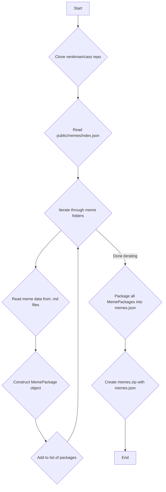

# Meme Extraction Agent

This script is an autonomous agent that scrapes the top meme posts from the SystemsWorld.club community page, extracts "meme packages," and packages them into a downloadable zip file.

## Local Execution

### Prerequisites

- [Bun](https://bun.sh/)

### Installation

1. Clone the repository:
   ```bash
   git clone <repository-url>
   cd <repository-directory>
   ```
2. Install the dependencies:
   ```bash
   bun install
   ```

### Usage

Run the agent from the command line, providing the desired name for the output zip file.

```bash
bun run index.ts <output-zip-file>
```

To see the full list of options, run the script with the `--help` flag:

```bash
bun run index.ts --help
```

**Example:**

```bash
bun run index.ts memes.zip
```

This will create a `memes.zip` file in the root directory containing the extracted meme packages and associated images.

## Workflow

The following diagram illustrates the workflow of the meme extraction agent:



## Remote Execution

To run the agent on a schedule, you can use a tool like `cron`. This is useful for keeping the meme packages up-to-date without manual intervention.

### Cron Job Example

The following cron job will run the agent every day at 3:00 AM, save the output with a timestamp, and log any output to a file.

```bash
0 3 * * * cd /path/to/your/project && /home/user/.bun/bin/bun run index.ts memes-$(date +\%Y-\%m-\%d).zip >> /var/log/meme-agent.log 2>&1
```

**Note:** Make sure to replace `/path/to/your/project` with the absolute path to the project directory and `/home/user/.bun/bin/bun` with the correct path to your Bun executable.
